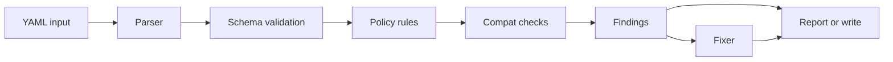

# Cairn

**Cairn** scans Kubernetes YAML for security misconfigurations and applies deterministic fixes — offline, from the CLI, before manifests hit a cluster.

The long-term goal is secure workloads by default: non-root containers, pinned images, signed artifacts, and trusted supply chains. Today Cairn covers the first layer — Pod Security-style hardening on core workload resources (Deployment, Pod, StatefulSet, and similar). Image signing and supply-chain enforcement are on the roadmap, not in the tool yet.

---

## What works today

Cairn reads YAML from a file, directory, or stdin, runs a stack of checks, and returns structured findings. Each finding says what's wrong, where it lives in the manifest, how serious it is, and whether Cairn can fix it automatically. The `fix` command applies those fixes and shows a diff before writing anything.

| Area | Status |
|------|--------|
| Multi-doc YAML parsing (file, dir, stdin) | Done |
| Schema validation (kubeconform / OpenAPI) | Done |
| Policy rules: `runAsNonRoot`, `readOnlyRootFilesystem`, floating image tags | Done |
| API version deprecation detection + basic migration | Done (apiVersion only) |
| `scan`, `fix`, `compat` commands | Done |
| kubectl error → fix mapping (`--from-error`) | Done (partial rule coverage) |
| Optional cluster probe (`--cluster`) | Done (version string enrichment only) |
| JSON output, dry-run diffs, `--out` writes | Done |

### How it flows



Both `scan` and `fix` run the same detection pipeline. Fix is scan plus patch.

---

## Quick start

Requires Go 1.26+.

```bash
git clone https://github.com/jackalgg/cairn.git
cd cairn
go build -o cairn .

# Scan the sample insecure Deployment
./cairn scan test.yaml

# Preview fixes without writing
./cairn fix --dry-run test.yaml

# Apply a specific fix
./cairn fix test.yaml --fix-id pss-run-as-non-root

# JSON output for CI pipelines
./cairn scan --format json test.yaml
```

[`test.yaml`](test.yaml) is an intentionally insecure Deployment (`nginx:latest`, no `securityContext`). A scan should surface three findings: one error and two warnings.

`scan` exits with a non-zero code when error-severity findings remain — useful in CI.

Run the test suite:

```bash
go test ./...
```

---

## Commands

| Command | Description |
|---------|-------------|
| `cairn scan [path]` | Parse and check manifests; print findings |
| `cairn fix [path]` | Scan, apply auto-fixes, write or diff output |
| `cairn compat [path]` | Check and migrate deprecated API versions |

`path` can be a file, a directory (all `.yaml`/`.yml` files), or `-` for stdin.

### Global flags

| Flag | Default | Description |
|------|---------|-------------|
| `--format` | `human` | Output format: `human` or `json` |
| `--kubernetes-version` | `1.30` | Kubernetes version for OpenAPI schema validation |
| `--target-version` | (same as above) | Target version for API compatibility checks |
| `--severity` | `warning` | Minimum severity to report: `error`, `warning`, or `info` |
| `--cluster` | `false` | Probe live cluster via kubeconfig |
| `--kubeconfig` | (default path) | Path to kubeconfig file |
| `--context` | (current context) | Kubeconfig context name |

### Fix flags

| Flag | Description |
|------|-------------|
| `--dry-run` | Show diff without writing files |
| `--out <dir>` | Write fixed manifests to a directory |
| `--fix-id <rule>` | Apply only findings matching a rule ID (repeatable) |
| `--from-error <text>` | Match fixes to kubectl/admission error text |
| `--stdin-errors` | Read error text from stdin (pipe from `kubectl apply`) |

Example reactive workflow:

```bash
kubectl apply -f test.yaml 2>&1 | ./cairn fix test.yaml --stdin-errors --dry-run
```

### Cluster mode

With `--cluster`, Cairn connects to your kubeconfig, reads the server version, and enriches finding messages with cluster context. It does **not** modify the cluster, fetch live resources, or generate manifests from running workloads. That generator is planned — see [Roadmap](#roadmap).

Schema validation requires network access on first run (kubeconform downloads OpenAPI schemas from GitHub).

---

## Architecture

The CLI is thin; logic lives in `internal/`:

| Package | Role |
|---------|------|
| `internal/parser` | Multi-doc YAML parsing, GVK extraction |
| `internal/engine` | Orchestrates parse → validate → policy → compat → findings |
| `internal/schema` | kubeconform OpenAPI validation |
| `internal/policy` | Security rules with optional fix functions |
| `internal/compat` | Deprecated API version detection and migration |
| `internal/k8serrors` | kubectl/admission error string → rule mapping |
| `internal/cluster` | Optional live cluster probe |
| `internal/fixer` | Apply fixes, produce diffs, write output |
| `internal/report` | Human and JSON output |

Each policy rule implements `AppliesTo`, `Check`, and optionally attaches a `Fix` — a function that mutates the manifest. Detection and remediation stay linked so fix logic doesn't drift from detection logic.

Manifests are handled as Kubernetes `unstructured` objects rather than typed structs, which keeps the tool workable across many resource kinds and CRDs without a struct per kind.

---

## Roadmap

### Live cluster YAML generator

Cairn should eventually probe a live cluster — server version, enabled APIs, namespace Pod Security Standards labels — and produce manifests that are compatible with *that* environment. Fixed YAML gets written to disk; nothing is applied in-cluster.

Today the cluster probe only appends a version string to two finding messages. The generator will wire probed capabilities into schema validation and compat checks, and add something like `cairn generate` for cluster-aware manifest output.

### Interactive CLI

Fixes should be recommended, not forced. An interactive mode (`cairn fix --interactive`) will present each finding with a suggested fix and let the admin accept or skip. Non-interactive mode stays the default for CI and scripting.

### Also planned

- Format-preserving YAML rewrites (comments, ordering, whitespace)
- SARIF output for CI and security tooling integrations
- CRD schema support via `--schema-location`
- Broader resource coverage (Service, Ingress, NetworkPolicy)
- Signed-image and supply-chain policy rules (cosign / sigstore)
- Expanded Pod Security Standards coverage

---

## Known limitations, TODOs, and audit findings

This section tracks what we know is rough. It's here on purpose — Cairn will be open source, and we'd rather document gaps than hide them.

See [SECURITY.md](SECURITY.md) for vulnerability reporting.

### Bugs to fix before public release

**Critical / High**

- **DocIndex collision on directory scans** — [`internal/parser/parser.go`](internal/parser/parser.go) resets document index per file, but [`internal/fixer/fixer.go`](internal/fixer/fixer.go) keys working documents by index only. Scanning a directory can cause fixes to target the wrong manifest across files.
- **YAML round-trip fidelity** — the fixer re-marshals with `yaml.Marshal`, which drops comments, field ordering, anchors, and formatting. Even a one-field fix rewrites the whole file.
- **In-place writes without atomic rename or backup** — `fix` overwrites the source file directly via `os.WriteFile`. A crash mid-write can corrupt manifests.
- **`--out` path traversal** — [`outputPath`](internal/fixer/fixer.go) joins `outDir` with the source path without containment checks. A relative source like `../../outside.yaml` can escape the output directory.
- **Unbounded file and stdin reads** — no size or depth limits on YAML input (YAML bomb / DoS risk).
- **`compat` checks stale findings post-fix** — [`cmd/compat.go`](cmd/compat.go) evaluates success against the original scan, not a re-scan after applying fixes.
- **Stdin fix flow broken** — stdin is consumed on the first scan; the post-fix verification re-scan reads nothing. Fixes on `-` without `--out` are never written.

### Security and safety

**Medium**

- In-place overwrite should require an explicit `--in-place` flag rather than being the silent default.
- Cluster mode loads kubeconfig credentials; minimum RBAC scope and behavior are not documented.
- `--cluster` help text mentions PSS context, but the probe only appends a server version string to two rule messages today.
- Output files are written with world-readable permissions (`0o644`).
- Multi-doc splitting uses naive `---` delimiter matching, which can break if `---` appears inside multiline strings.

### Engineering and OSS hygiene

**Medium / Low**

- No `CONTRIBUTING.md` or `CODE_OF_CONDUCT.md` yet.
- CI runs `go test` and `go build` only — no lint (`golangci-lint`), race detector, or coverage reporting.
- `internal/fixer`, `internal/compat`, `internal/schema`, `internal/cluster`, and `internal/report` have no tests.
- The built `cairn` binary is not in [`.gitignore`](.gitignore).
- LICENSE copyright ("Michael Ott") does not match the module owner (`github.com/jackalgg/cairn`).
- No version subcommand or release workflow (GoReleaser, Homebrew, etc.).
- No `examples/` directory beyond [`test.yaml`](test.yaml).

### Technical debt

**Medium / Low**

- API migration in [`internal/compat/compat.go`](internal/compat/compat.go) only updates `apiVersion`/`kind`. Ingress migration from `extensions/v1beta1` needs field-level changes (`pathType`, `ingressClassName`, etc.).
- `targetVersion` appears in compat messages but does not gate which migrations run.
- `--from-error` maps `schema-unknown-field` and `api-version-deprecated` but those rules have no fix functions wired in [`internal/k8serrors/parser.go`](internal/k8serrors/parser.go).
- Finding paths use `containers.<name>` notation, but containers in YAML are a list, not a map keyed by name.
- Dead code in [`internal/policy/helpers.go`](internal/policy/helpers.go) (`ensureNestedMap` is unused and contains a bug).
- Fix orchestration is duplicated between [`cmd/fix.go`](cmd/fix.go) and [`cmd/compat.go`](cmd/compat.go).

### Policy coverage gaps

- Partial Pod Security Standards: missing checks for `privileged`, `allowPrivilegeEscalation`, capabilities, seccomp, and `runAsUser`.
- No checks on `initContainers` or `ephemeralContainers`.
- `image-floating-tag` warns on `:latest` and untagged images but cannot pin without registry lookup.
- No signed-image or supply-chain rules (cosign, sigstore, SBOM) despite being part of the project vision.

---

## License

Apache License 2.0 — see [LICENSE](LICENSE).
